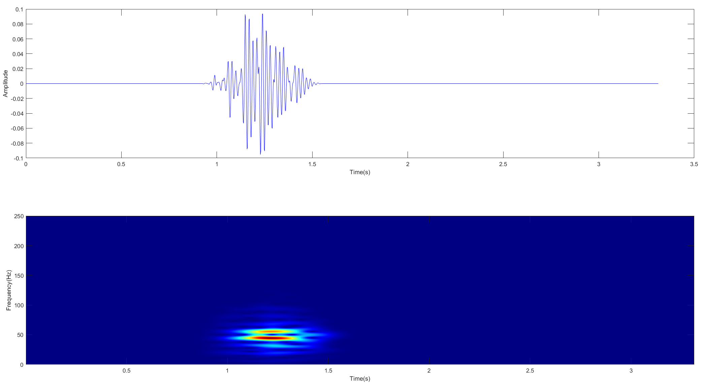

# SFIDS-SA
Adaptive Suppression of Single-Frequency Interference
The program runs in MATLAB, and the author developed it using MATLAB version 2022b. All programs have been debugged. If any errors occur during execution, simply switch to a different MATLAB version.
First, the test.m file serves as the test program. After running it, the program should complete within 30 seconds. If the following figure is obtained, the program is functioning correctly. This test program requires no parameter modifications.

Next, run the real_signal_process.m file, which is used for processing real microseismic signals. After clicking run, the program should also finish within 30 seconds. Without making any modifications to the code, you can directly obtain the processing result of the first real microseismic signal. The output figure is shown as follows:

The second signal corresponds to the third column in the text file E01_240731_104328334. By replacing the imported data, you can obtain the denoising results of the two real microseismic signals.

(Note: If an error occurs when running the test.m file, run the Test_ourdata.m file first.)
