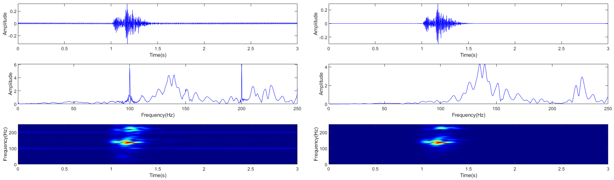
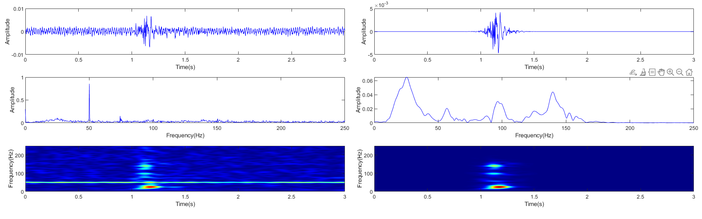

# SFIDS-SA
# Adaptive Suppression of Single-Frequency Interference(MATLAB)

Description:

Firstly, we employ the particle swarm optimization (PSO) algorithm to determine the globally optimal modal parameter K required for VMD which can effectively prevent over-decomposition or incomplete decomposition caused by manually set parameters. Then, VMD decomposition is performed in combination with a single-frequency interference detection standard and suppression algorithm (SFIDS-SA) to adaptively remove single-frequency interference. Finally, DL is applied to further suppress other noise.

Key features:

1.Adaptive suppression of single-frequency interference.

2.Perform layered processing on noise.

Requirements

1.MATLAB R2022B OR later.

2.Signal processing tool.

Input Files

1.s_clean.txt.

2.s_noise.txt.

3.E01_240730_091352386.txt.

4.E01_240731_104328334.txt.

Usage

All programs have been debugged. 

If any errors occur during execution, simply switch to a different MATLAB version.

1.Run the code (Synthetic signal)

First, the test.m file serves as the test program. After running it, the program should complete within 30 seconds. 

If the following figure is obtained, the program is functioning correctly. This test program requires no parameter modifications.

2.Run the code(Actual signal 1)

Next, run the real_signal_process.m file, which is used for processing real microseismic signals. 

After clicking run, the program should also finish within 30 seconds. Without making any modifications to the code, you can directly obtain the processing result of the first real microseismic signal. 
The output figure is shown as follows:

The loading method of Signal 1 is:data = load('E01_240731_104328334.txt'); 

The loading method of Signal 2 is:data = load('E01_240730_091352386.txt');

3.Run the code(Actual signal 2)

The second signal corresponds to the third column in the file E01_240731_091352386.txt. By replacing the imported data, you can obtain the denoising results of the two real microseismic signals.

(Note: If an error occurs when running the test.m file, run the Test_ourdata.m file first.)
